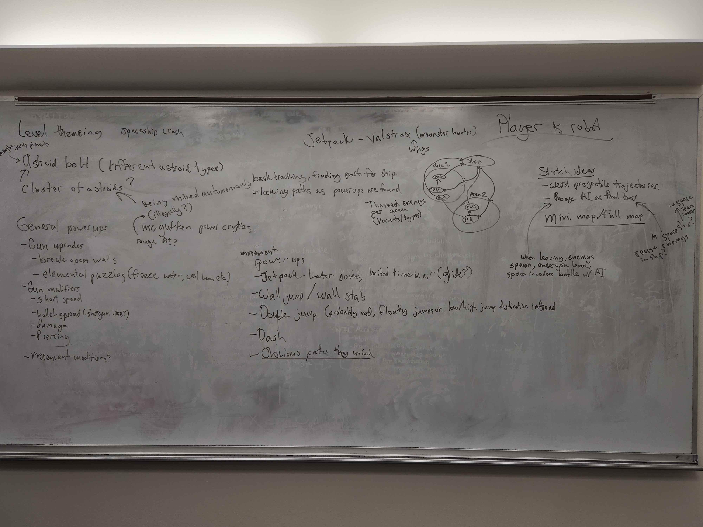

# GAME (Name TBD) GDD

## Core Concepts
- Metroidvania, mainly on the side of metroid. Sci-fi theme
- Side scroller with simple platforming and puzzles
- Hollow knight style save points

## Core Mechanics
- Side scroller  room based movement, like super metroid
- Directional aiming (mouse or right stick)
- Movement upgrades
    - Dash
    - Double jump
    - Wall jump
    - jetpack or wings (terraria wings)
- Weapon upgrades? (Brainstorm)
    - Elemental Types? (Could be good for puzzles.)
        - Fire 
        - Electric
        - Ice
    - ...BIG FUCKING GUN (a.k.a. Death)
    - Projectile Trajectories? (Interesting, but harder to make)
        - Boomerangs
        - Inverse Gravity
        - Etc.
    - Basic Modifiers? (Basic but still influential)
        - Bullet Spread
        - Shot Speed
        - Shot Damage
        - Piercing?
- Save points
    - Prompt Save or Place Save points following certain objectives
    - Keep maybe 1 or 2 previous saves
        - Save local date-time or just order saves to differentiate between saves 
    - Save node tree for MOST player and item progression
        - Perhaps save a world state manager for level/objective/puzzle progression/actions (Just an Idea, but could work well for basic stuff, kinda like the game manager but specifically for level states)
- Themed areas

## Level design?

## Art direction

## TODO tasks
- Meet to figure out mechanics we want, what power-ups, etc
- Figure out art direction
- Figure out story/lore
- Probably do this SCRUM style
- Get Github issues up and running and assigns tasks for the week
- Establish a general timeline for Core Features
### Core
- Basic user HUD
- Generic node based state machine implementation
- Player controller
- Node based weapon system
- Particle effects
- Enemy AI based off of state machines
- Level design
- Power-up system
- Collectables (coins or something like that)
- Save points / checkpoints
- Themed areas (brainstorm these)
    - Tile sets for each
    - Parallax backgrounds
    - Enemy Types / Variants
    - ???
    - ???
    - ???

### Stretch
- Randomization
    - Archipelago randomization (hard)
- More areas
- End boss
- Easter eggs
- Foreground Elements
    - Time consuming but more immersive environments

### Brainstorm:

